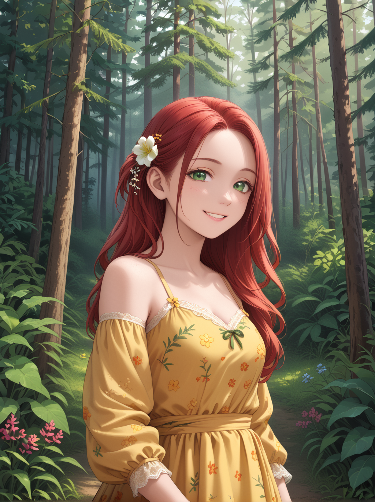

# SoftFill Pipeline

Notice! This is only the initial commit of this pipeline, it is by no means functioning properly yet... Check back in a few days.

SoftFill is a diffusers pipeline that integrates established inpainting and differential diffusion techniques to generate and refine images. This pipeline is designed to leverage an InPaint phase for generating rough content and a DiffDiff phase for refining and blending that content seamlessly with the original image.

This is modified from the base pipeline -> Diffusers 'pipeline_stable_diffusion_xl_inpaint.py'. Implementing Differential Diffusion, which is a map-gated img2img method proposed by https://github.com/exx8

## Overview

SoftFill operates in two primary phases:

- **Inpainting Phase:**  
  This phase uses a standard inpainting method to produce a rough output. The process begins by masking the input image. The mask is converted into a tensor and binarized to clearly indicate regions for modification. The inpainting model then generates new content based on the provided prompt.

- **DiffDiff Phase:**  
  After the initial inpainting, a derivative map is computed from the original mask. This map is inverted and resized to the latent resolution. The DiffDiff phase applies a map-gated img2img process where per-step thresholds are calculated over the denoising steps. Binary masks derived from these thresholds are used to guide the refining and blending of the inpainted content with the original image, ensuring smooth integration.

## Test the Pipeline

1. **Copy Structure:**
```
└── 📁any-folder
    └── pipeline_stable_diffusion_xl_softfill.py
    └── test_sdxl_softfill.py
    └── setup.sh
    └── any-sdxl-model.safetensors
    └── image.png
    └── mask_image.png
```
2. **Run the Setup file:**
  ```bash
  bash setup.sh
  ```
Note: You may need to use "python3" instead of "python" in 'setup.sh'.

3. **Add Model to 'test_sdxl_softfill.py':**
  ```python
  pipeline = StableDiffusionXLSoftfillPipeline.from_single_file(
  --> "any-sdxl-model.safetensors", <--
      torch_dtype=torch_dtype,
      use_safetensors=True,
  ).to(device)
  ```

4. **Add your image.png:** The image you want to modify.


5. **Add your mask_image.png:** A blurred mask of where you want to modify.


6. **Add your Prompt in 'test_sdxl_softfill.py':**
  ```python
  prompt = "describe what you want to see in the masked area"
  negative_prompt = "describe what you do NOT want to see in the masked area"
  ```
Note: Only describe within masked area.

7. **Activate your Virtual Environment':**
  ```bash
  source .venv/bin/activate
  ```

8. **Run the 'test_sdxl_softfill.py':**
  ```bash
  python test_sdxl_softfill.py
  ```

9. **An example Result:**
