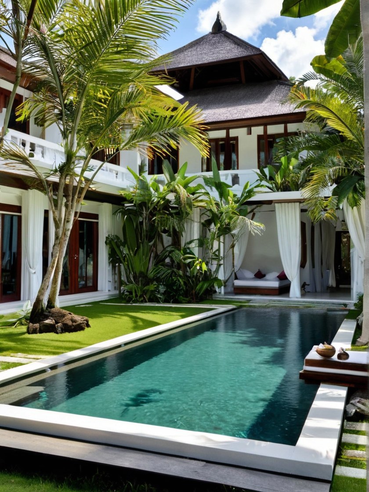
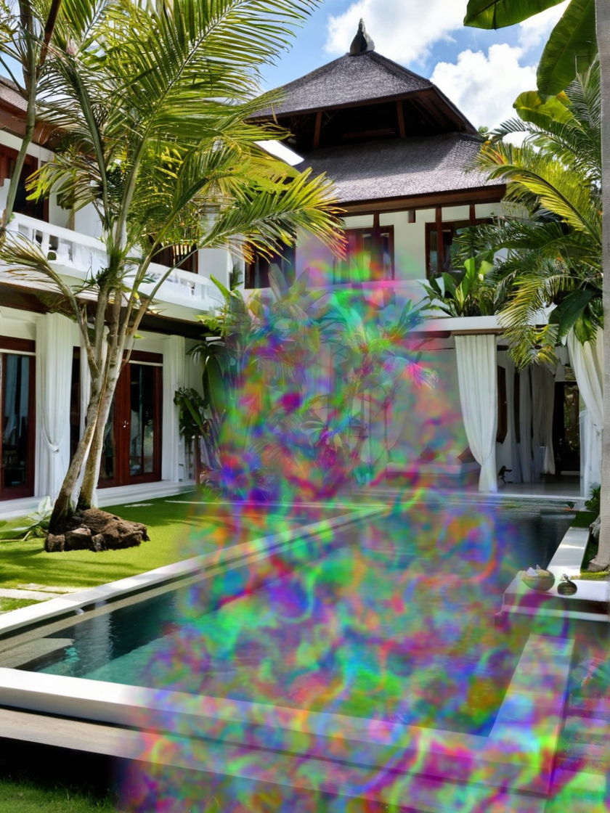
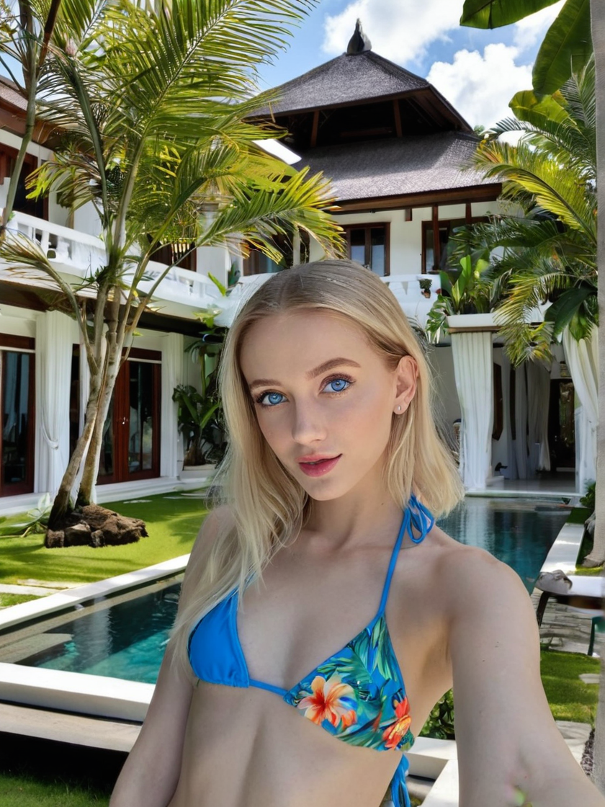

# SoftFill Pipeline

SoftFill is a Diffusers pipeline based on Differential Diffusion, incorporating input and preprocessing modifications that enable it to function more like "soft inpainting"—without requiring additional inference steps. A small addition of nondeterministic, fluid-like noise fill proves surprisingly effective at guiding the img2img process to produce outputs within the masked region that align closely with the mask's shape. I tested a variety of noise patterns, opacities, edge fades, and other parameters, and found this configuration to yield the best results so far. If I discover an approach that performs better, I’ll update the pipeline’s preprocessing accordingly.

Differential Diffusion is proposed and developed by https://github.com/exx8 <br>
Standard differential img2img pipeline can be found at https://github.com/huggingface/diffusers/blob/main/examples/community/pipeline_stable_diffusion_xl_differential_img2img.py

#### Modifications of DiffDiff:
- Accepts an "image" and "mask" in PIL format.
- The mask should be a standard blurred mask, where white areas represent the inpaint area.
- The pipeline preprocesses the image to generate a randomly warped perlin noise in the >0.5 mask area and pastes that noise onto the image.
- The noise has an opacity of 0.75, allowing the img2img processes to still get some background context if needed.
- The noise has an edge fade which attempts to be half the mask's blur radius.

#### Additional Notes:
- The noise is applied by default and is optional; "noise_fill_image=True". If you are attempting to modify existing content, this should be False. If you have drawn the desired object onto the image already, this should be False.
- Experiment with different "strength" values from 0.6 to 1.0, gradually increasing the strength until the noise is no longer visible. Increasing strength can also produce a more saturated/contrasted result. But generally, the lowest possible strength is ideal.

## Test the Pipeline

1. **Copy Structure:**
```
└── 📁any-folder
    └── pipeline_stable_diffusion_xl_softfill.py
    └── test_softfill.py
    └── setup.sh
    └── any-sdxl-model.safetensors
    └── image.png
    └── mask.png
```

2. **Run the Setup file:**
```bash
bash setup.sh
```
Note: You may need to use "python3" instead of "python" in 'setup.sh'.

3. **Add Model to 'test_softfill.py':**
```python
pipeline = StableDiffusionXLSoftFillPipeline.from_single_file(
--> "any-sdxl-model.safetensors", <--
    torch_dtype=torch_dtype,
    use_safetensors=True,
).to(device)
```

4. **Add your Prompt in 'test_softfill.py':**
```python
prompt = "describe what you want to see in the masked area"
negative_prompt = "describe what you do NOT want to see in the masked area"
```
Note: Only describe within masked area.

5. **Activate your Virtual Environment':**
```bash
source .venv/bin/activate
```

7. **Run the 'test_softfill.py':**
```bash
python test_softfill.py
```

## Example Image Process
**Model Used:** https://civitai.com/models/277058?modelVersionId=1522905 <br>
**prompt=** selfie photo of pretty girl, with blue bikini top, blue eyes, at beautiful white tropical bali villa pool <br>
**negative_prompt=** deformed, bad anatomy, from above, fat, lowres, lower body, nude, nsfw, nipples, mirror, holding phone <br>
**num_inference_steps=** 32 <br>
**guidance_scale=** 4, <br>
**strength=** 0.8, <br>
**noise_fill_image=** True,

| Image | Mask | Noised | Result |
|----------------|------|-------------------|---------------|
|  |  |  |  |
